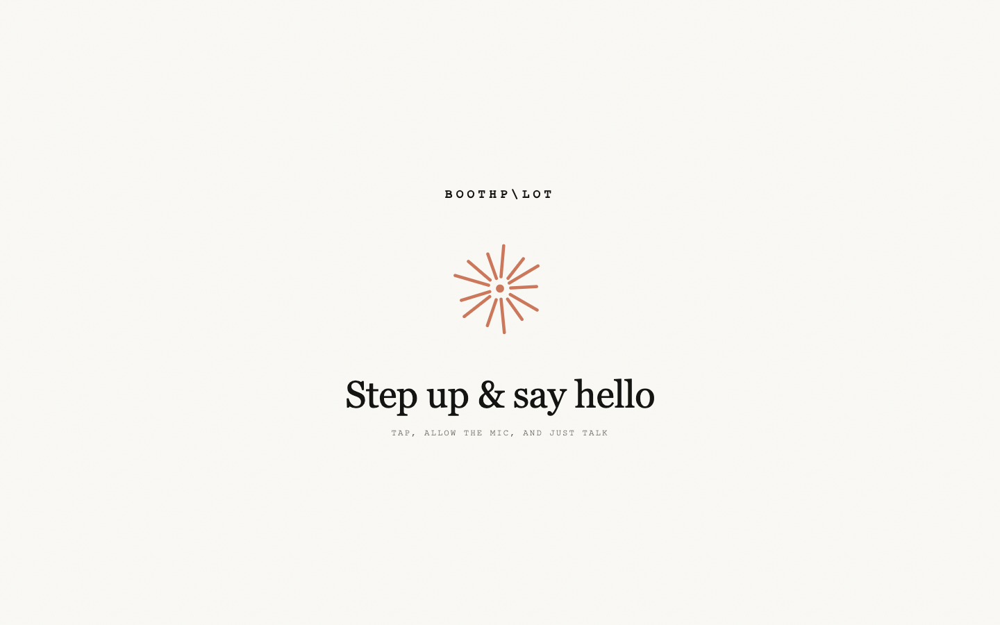
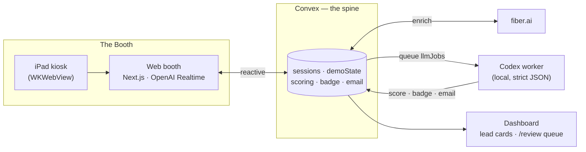
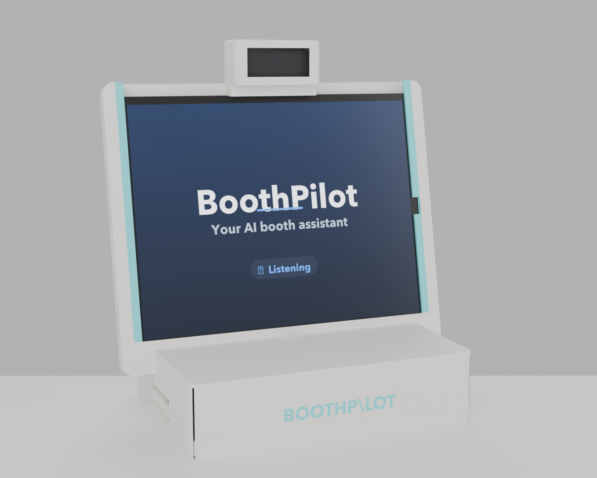

<div align="center">

# ✦ BoothPilot

### The AI booth concierge that turns a hallway conversation into pipeline.

*A visitor walks up. Ninety seconds later they've had a real conversation, seen the product demo their exact problem, and walked away with a shareable badge — while the team gets a scored lead and a ready-to-send follow-up.*

<br/>


<br/>



</div>

---

BoothPilot is a live conference-booth concierge for a (fictional) SaaS, **Quill** — an AI customer-support agent. It captures the visitor conversation by voice, enriches the lead in real time, drives an on-screen product demo tailored to what they actually said, scores the opportunity, mints a shareable **Booth Badge**, and drafts a **human-reviewed** follow-up email. It runs on an iPad in a fully 3D-printed stand — the iPad is a kiosk shell around the deployed web booth, so it behaves exactly like the live site.

Built for the sponsor stack: **OpenAI · Convex · Cursor · fiber.ai · ElevenLabs**.

<br/>

## ✷ The ninety seconds

| | |
|---|---|
| **1 · Walk up** | The booth greets the visitor by voice (OpenAI Realtime). |
| **2 · Identify** | Scan a LinkedIn QR or just say your name + company → **fiber.ai** enriches you into a live CRM card (firmographics, role, work email). |
| **3 · Demo** | The agent drives the *Quill* product to the visitor's exact use case — shared-state, not browser automation, so it never breaks. |
| **4 · Score** | Confidence + urgency are computed in the background, with reasons — **never shown to the visitor.** |
| **5 · Badge** | The visitor gets a shareable, collectible **Booth Badge** — an archetype, a grounded compliment, stat bars, and a discount, via QR. |
| **6 · Follow-up** | The team gets a drafted email in a **review queue**. Nothing is ever auto-sent. |

<br/>

## ✷ Architecture



- **`convex/`** — the realtime spine: sessions (the CRM card), transcript, demo state, fiber enrichment, lead scoring, badges, the email review queue, and the `llmJobs` queue.
- **`dashboard/`** — Next.js app: the **web booth** (`/booth`), the live **demo** (`/demo`), shareable **badges** (`/badge` + Open Graph image), and the **review queue** (`/review`).
- **`llm-worker/`** — a local pull-worker (OpenAI **Codex SDK**) that claims `llmJobs`, returns strict JSON, and writes the final score / badge / email back through Convex. `finalize` never sends email — if the worker is offline, Convex finishes the card with a deterministic safety fallback after ~25s.
- **`ios/`** — the SwiftUI kiosk that loads the web booth in a full-screen WebView and grants it mic + camera natively.
- **`hardware/`** — the parametric, fully 3D-printed iPad stand.

<br/>

## ✷ The booth, in the flesh

<div align="center">

<br/><em>Parametric, 100% printed joinery — no fasteners.</em>
</div>

<br/>

## ✷ Run it locally

Three terminals from the repo root:

```bash
# 1 — Convex spine
npx convex dev

# 2 — dashboard + web booth
cd dashboard && npm install && npm run dev

# 3 — local Codex worker (scoring / badge / email)
cd llm-worker && npm install && npm start
```

The dashboard reads `dashboard/.env.local`:

```bash
NEXT_PUBLIC_CONVEX_URL=https://<your-deployment>.convex.cloud
```

Handy:

```bash
npx convex run seed:run            # seed demo data
npx convex run sessions:list '{}'  # inspect the CRM cards
node scripts/simulate-visitor.mjs  # drive a fake visitor end-to-end
```

> Email stays human-in-the-loop: review a draft in `/review`, approve or edit, then send. Real sends require `RESEND_API_KEY` + a verified sender.

<br/>

## ✷ Repo map

```
BoothPilot/
├─ convex/        # realtime spine — sessions, scoring, fiber, badge, email, llmJobs
├─ dashboard/     # Next.js — /booth /demo /badge /review + editorial UI
├─ llm-worker/    # local Codex worker — strict-JSON score/badge/email
├─ ios/           # SwiftUI kiosk wrapping the web booth
├─ hardware/      # parametric 3D-printed iPad stand (STL/STEP/3MF + renders)
└─ docs/          # design + runbook notes
```

<br/>

<div align="center">

**Built in 24 hours at the YC AI Growth Hackathon by Orange Slice.**

*OpenAI · Convex · Cursor · fiber.ai · ElevenLabs*

</div>
