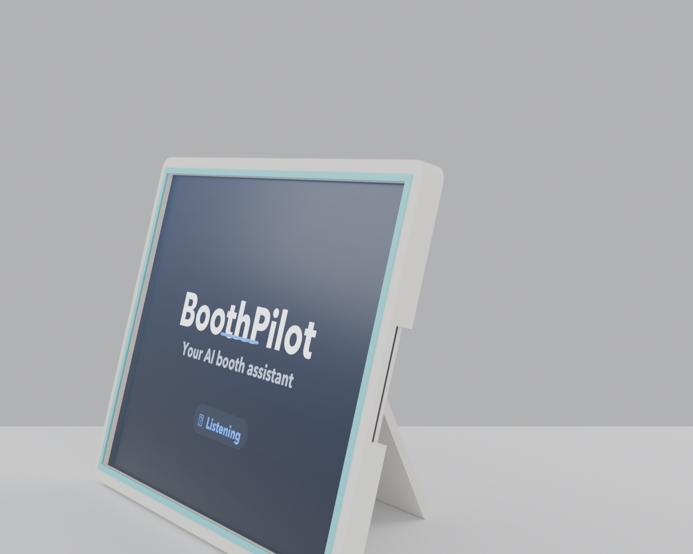

# iPad Easel Stand (HA-Screen adaptation)

A thin **picture-frame** stand for an **iPad Pro 12.9" (5th gen)** in landscape,
propped by a **fold-out kickstand leg** — adapted from the *HA Screen* tablet
stand that this was based on, rescaled from its ~8" panel to the 12.9" iPad and
made fastener-free. Bone-white body, a thin cyan frame around the screen.

**100% 3D-printed — no screws, pins, nuts, or glue.** The panel sandwiches the
iPad and snaps shut; the leg's rod snaps into cradles on the back and folds flat.




## Parts (5 printed pieces)

| Part | File | Size (mm) | Notes |
|------|------|-----------|-------|
| Bezel — left | `front_left` | 154 × 230 × 11 | Screen-side frame half |
| Bezel — right | `front_right` | 148 × 230 × 11 | Snap-pegs clamp the sandwich |
| Tray — left | `rear_left` | 154 × 230 × 23 | Holds the iPad; hinge cradle |
| Tray — right | `rear_right` | 148 × 230 × 23 | Hinge cradle + seam pegs |
| Kickstand leg | `leg` | 180 × 190 × 8 | Rod snaps into the cradles, folds out |

The framed panel is ~296 mm wide, so the bezel and tray each split down the
centre to fit a 256 mm bed. STEP + STL for every part are in `ha_out/`.

## How it goes together (no hardware)

1. **Seam** — press the two tray halves together; the integral pegs align them.
   Do the same for the two bezel halves.
2. **iPad** — lay the iPad face-up into the rear tray; it rests on the back ledge.
3. **Close the sandwich** — press the bezel onto the tray. The six snap-pegs push
   into the wall tops and clamp the iPad between the bezel lip and the tray ledge.
   The pegs also bridge the centre seam, locking both halves together.
4. **Leg** — push the leg's 8 mm rod up into the two C-cradles on the back until it
   snaps in (the throat grips >180°). It now folds flat for transport and swings
   out to prop the panel.
5. **Stand it** — open the leg; the panel leans back 15° on the desk.

## Bill of materials

**Printed:** the 5 parts above — ≈ 0.45 kg PLA at ~15% infill (bone-white, a few
grams of cyan for the screen frame if printed multi-colour). **Hardware: none.**

**You supply:** one iPad Pro 12.9" (5th gen), and a USB-C cable (routes out the
side slot).

## Print settings

- **Material:** PLA. Body bone-white; optional cyan for the screen frame.
- **Walls:** 3 mm (≈4 perimeters), 15–20% infill.
- **Layer height:** 0.2 mm.
- **Bed:** fits 256 × 256 mm — every part prints without splitting further.
- **Orientation:** bezel screen-face-down (pegs up); tray back-face-down (cradles
  up); leg flat on its plate (the rod knuckle wants light support).
- **Supports:** only under the leg rod; everything else prints clean.

## Fit notes

Cavity is 281.6 × 215.9 × 7 mm for a 280.6 × 214.9 × 6.4 mm iPad (0.5 mm clearance
each side). Hinge rod is 8 mm into a 8.7 mm bore with a 7 mm snap throat; seam and
peg joints use 0.3 mm clearance. If your printer runs tight, bump `seam_clear` /
`rod_clr` in `ha_stand.py` by 0.1 mm. The USB-C/speaker slots sit on the short
(side) edges — confirm against your unit's orientation before a full print.

## Regenerate

```
pip install cadquery==2.5.2
python ha_stand.py      # writes ha_out/{step,stl}
```
